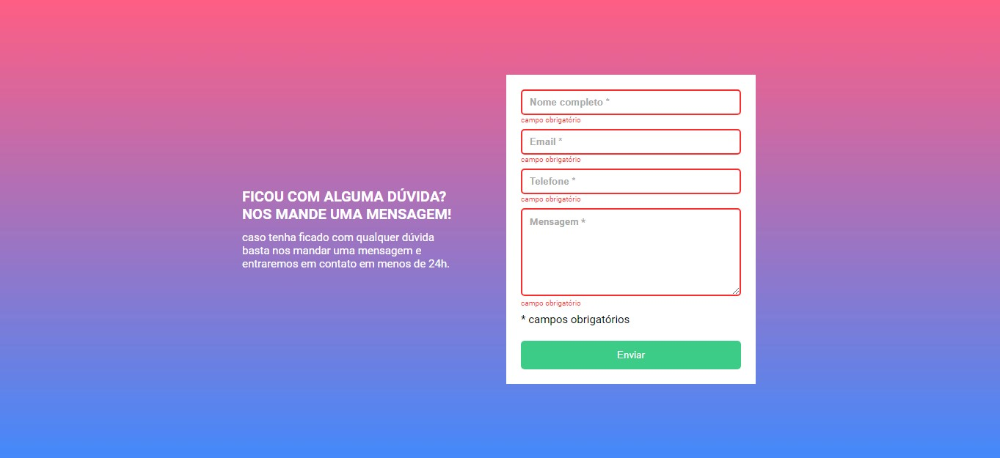
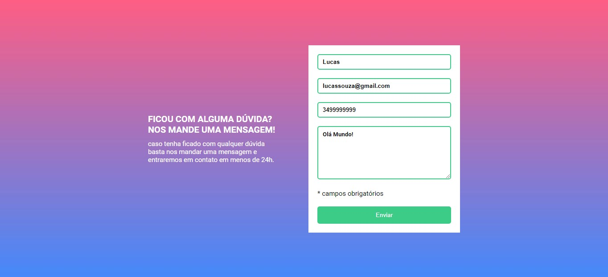

# Quest HTML + CSS + JS Intermediário

## 📃Descrição
Olá turma, espero que todos estejam bem! Fui desafiado no curso DevQuest a fazer um formulário com validação usando apenas HTML, CSS e JS puros. O formulário em si é apenas para treinar habilidades voltadas para o Desenvolvimento Frontend, portanto, não tem integração com o backend. De maneira simplificada, se o usuário tentar enviar o formulário com campos vazios, estes campos ficarão vermelhos e aparecerá uma mensagem de erro, caso contrário, os campos ficarão verdes.

## 🏋️‍♀️Dificuldades 
Minha maior dificuldade foi criar uma solução geral para todos os inputs. No começo, a única solução que encontrei foi tratar cada input separadamente, o que ocasionou em um código verboso. Após uma análise mais aprofundada, consegui refatorar o código e encontrar uma solução generalizada.

## 💻Tecnologias Utilizadas
- HTML5
- CSS3
- Javascript 

